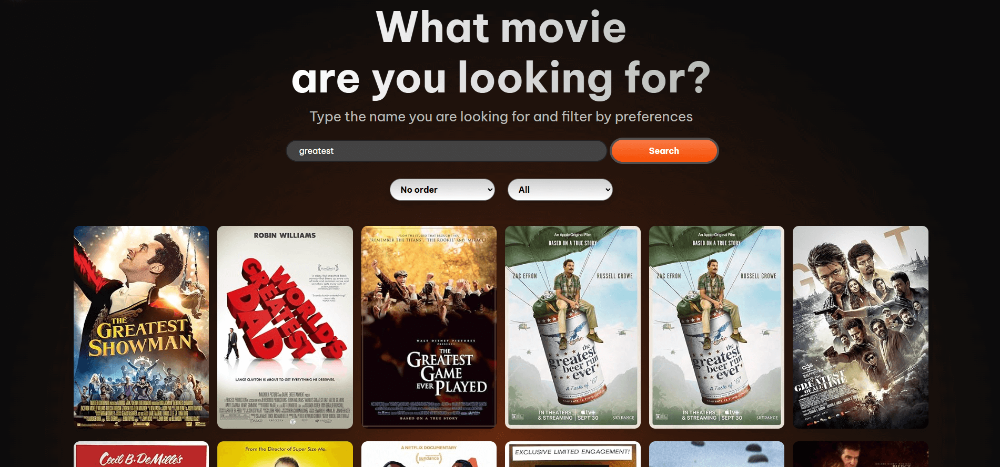
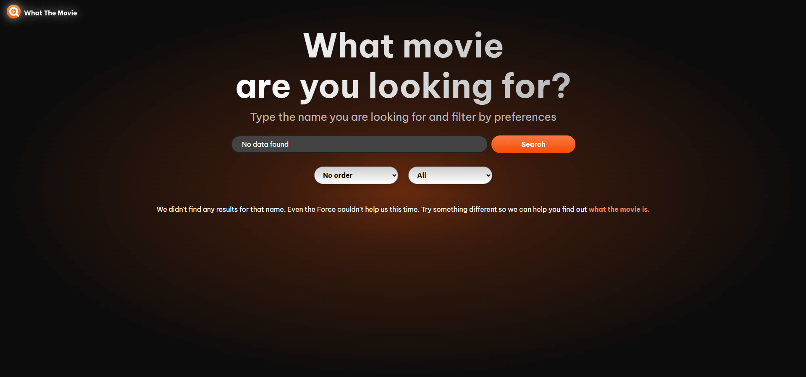
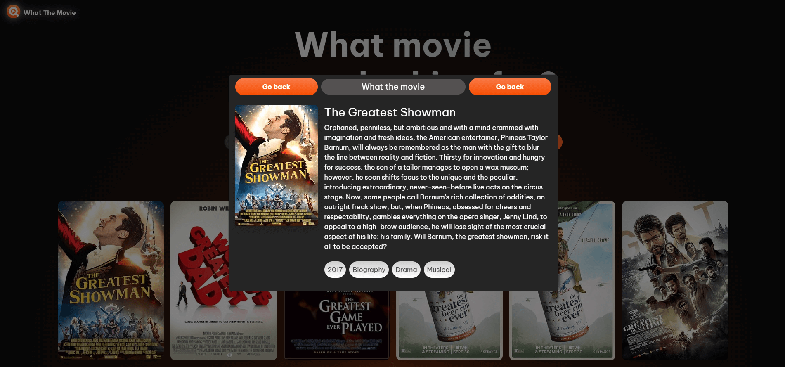

# What the movie

## Descripcion

🎬 **What the Movie** is a responsive web application that allows users to search for movies via the [OMDb API](https://www.omdbapi.com/). Built with Angular and TypeScript, it includes reactive forms, filtering, and sorting features, all wrapped in a clean and responsive UI.

--- 

## Tech stack

- Angular 19
- Html5
- CSS3
- Bootstrap
- TypeScript

---

## Functionalities

- Search movie by title
- Order by date 
- Filter by Genre

---

## Angular Features used

- Use of Angular lifecycle
- HTTP calls
- Reactive forms
- Responsive design
- Rxjs

---

## How to install: 

1. Copy the repository:

Open console

git clone https://github.com/JesusBrito1505/movie-search-app

cd movie-search-app

2. Install dependecies:

npm install

npm install bootstrap

Add bootstrap to angular.json :

"styles": [
    "node_modules/bootstrap/dist/css/bootstrap.min.css", 
    "src/styles.css"
    ]

3. Configure the environment:

Sign up into https://www.omdbapi.com/ and get an API Key.

// src/environments/environment.ts

export const environment = {
  production: false,
  apiUrl: 'https://www.omdbapi.com/',
  apiKey: 'YOUR_API_KEY_AQUI'
};

4. Execute the application:

ng serve

Open http://localhost:4200 in your browser

---

## Screenshoots

| Before Search | After search |
|------------|------------|
|  |  |
| No data found | Movie details |
|  |  |

## Autor:

Jesus Brito – @JesusBrito1505
📩 email@JesusBrito.Dev
💼 JesusEbrito
